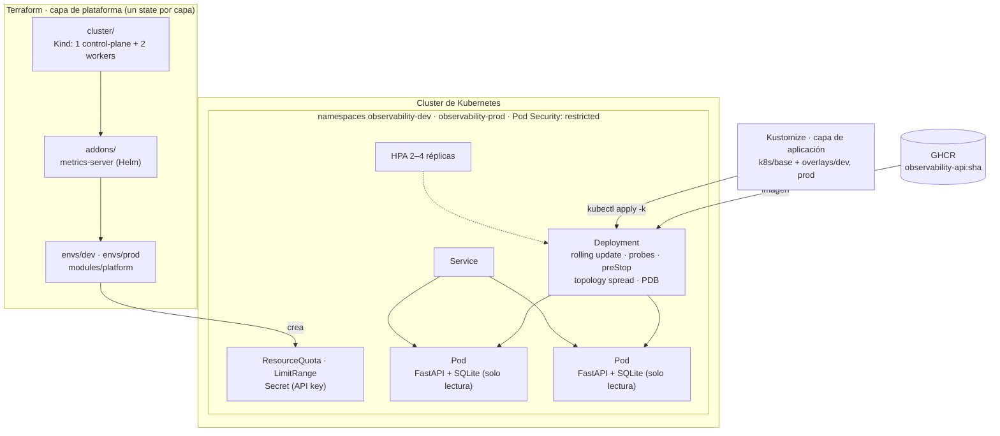

# Infrastructure Observability Platform

[English](README.md) · **Español**

[](https://github.com/GabrielPy28/infrastructure-observability-platform/actions/workflows/ci.yml)
[](https://github.com/GabrielPy28/infrastructure-observability-platform/actions/workflows/cd.yml)

Una plataforma DevOps con prácticas de producción, construida alrededor de una API
de monitoreo de infraestructura. **El producto es la plataforma**, no la API:

- infraestructura como código con Terraform;
- despliegues en Kubernetes sin downtime;
- un pipeline de CI/CD con controles de seguridad y pruebas end-to-end en un cluster
  efímero;
- escenarios de resiliencia con resultados medidos.

Todo se ejecuta en local sobre [Kind](https://kind.sigs.k8s.io/) con coste cero, y
un módulo de Terraform validado (nunca aplicado) describe la misma plataforma en
AWS EKS.

## Lo más destacado

- **Infrastructure as Code por capas:** Terraform crea el cluster, los add-ons de
  todo el cluster y cada entorno, cada uno con su propio state.
- **Frontera de responsabilidades clara:** Terraform gestiona la plataforma y
  Kustomize la aplicación. `terraform plan` no muestra drift después de desplegar.
- **Despliegues sin downtime:**
  - una versión defectuosa nunca recibe tráfico y se revierte automáticamente;
  - los pods terminan de forma ordenada;
  - las réplicas se reparten entre nodos y escalan con un HPA.
- **CI/CD que prueba lo que publica:** el pipeline publica la imagen en GHCR y
  después despliega **esa misma imagen** en un cluster nuevo creado por Terraform,
  verificando que los pods ejecutan el SHA del commit.
- **Seguridad por defecto:**
  - Pod Security `restricted`, contenedores no-root de solo lectura y API keys por
    entorno;
  - actions fijadas por SHA y security gates de Trivy para la imagen y la IaC.
- **Resiliencia medida:** 4 escenarios, **14.006 peticiones y 0 errores**. Además,
  destaparon 6 problemas reales, todos corregidos y documentados.

## Arquitectura



| Capa | Herramienta | Gestiona |
|---|---|---|
| Cluster | Terraform (`tehcyx/kind`) | Cluster Kind, kubeconfig |
| Add-ons | Terraform (`helm`) | metrics-server (alimenta al HPA) |
| Plataforma por entorno | Terraform (`kubernetes`) | Namespace con Pod Security `restricted`, ResourceQuota, LimitRange, Secret con la API key |
| Aplicación | Kustomize | Deployment, Service, HPA, PodDisruptionBudget, ConfigMap |

## Pipeline de CI/CD

```mermaid
flowchart LR
  DEV(["Desarrollador"]) -->|pull request| CI

  subgraph CI["CI · cada PR · 5 checks obligatorios"]
    direction TB
    CI1["App · ruff + pytest"]
    CI2["Docker · hadolint, build, Trivy"]
    CI3["Terraform · fmt, validate, tflint"]
    CI4["Kubernetes · kubeconform"]
    CI5["Seguridad · escaneo IaC con Trivy"]
  end

  CI -->|merge a main| PUB

  subgraph CD["CD · cada merge a main"]
    direction LR
    PUB["Build → Trivy gate<br/>→ push GHCR :sha"] --> UP["Cluster efímero<br/>task tf:up"]
    UP --> D1["Deploy dev<br/>→ smoke test"]
    D1 --> D2["Promoción a prod<br/>→ smoke test"]
    D2 --> DOWN["task tf:down"]
  end
```



- El pipeline **no tiene lógica de despliegue propia**: ejecuta los mismos comandos
  de Task que un desarrollador en local (`task tf:up`, `task k8s:apply`,
  `task k8s:smoke`).
- Si un rollout falla, `k8s:apply` ejecuta `kubectl rollout undo` y el job falla.
- El smoke test comprueba que `/readyz` devuelve el SHA del commit desplegado, lo
  que da trazabilidad de **commit → imagen → pod en ejecución**.

## Stack tecnológico

| Área | Herramientas |
|---|---|
| Aplicación | Python 3.12, FastAPI, SQLite, Faker (solo en el build), pytest, ruff |
| Contenedores | Docker multi-stage, no-root, sistema de archivos raíz de solo lectura |
| Kubernetes | Kind (Kubernetes 1.35), Kustomize, HPA, PDB, Pod Security Admission, metrics-server |
| Infrastructure as Code | Terraform (`tehcyx/kind`, `kubernetes`, `helm`, `random`, `aws`), tflint |
| CI/CD | GitHub Actions, GHCR, Dependabot |
| Seguridad | Trivy (imagen + IaC), hadolint, kubeconform, actions fijadas por SHA |
| Pruebas | pytest (31 tests), smoke tests, pruebas de carga con k6, escenarios de resiliencia |
| Herramientas | [Task](https://taskfile.dev): una única interfaz de comandos para el trabajo local y el CI |

## Inicio rápido

**Requisitos:**

- Docker;
- [kind](https://kind.sigs.k8s.io/) ≥ 0.31;
- kubectl;
- Terraform ≥ 1.10;
- [Task](https://taskfile.dev) 3.x;
- Python ≥ 3.10.

```bash
# 1. Plataforma: cluster Kind, metrics-server, entornos dev y prod
task tf:up -- -auto-approve

# 2. Construir la imagen, cargarla en Kind y desplegar
task k8s:deploy ENV=prod

# 3. Verificar el despliegue (salud, versión, API key, datos)
task k8s:smoke ENV=prod

# 4. Explorar la API en http://localhost:8080/docs → "Authorize" con la key
task k8s:api-key ENV=prod
task k8s:port-forward ENV=prod

# 5. Ejecutar los escenarios de resiliencia (~8 min)
task scenario:all

# 6. Destruirlo todo
task tf:down -- -auto-approve
```

Para trabajar en la API sin Kubernetes, ejecuta `task app:test` o `task app:run`
(Swagger en <http://localhost:8000/docs>). Ejecuta `task --list` para ver todos los
comandos.

## Escenarios de resiliencia

La disponibilidad se mide **desde dentro del cluster** con un pod cliente que envía
4 peticiones por segundo al Service. Un port-forward solo llegaría a un pod, así que
no reflejaría lo que ve un consumidor real.

| Escenario | Fallo provocado | Peticiones | Disponibilidad |
|---|---|---:|---:|
| 1. Despliegue sano | — | 63 | 100 % |
| 2. Fallo de pod y nodo | Borrado de un pod, drain de un nodo, reinicio progresivo | 190 | 100 % |
| 3. Despliegue defectuoso | Versión que nunca pasa a Ready → deadline superado → rollback | 545 | 100 % |
| 4. Autoescalado | Carga con k6: el HPA pasa de 2 a 4 réplicas en 51 s, p95 de 12 ms | 13.208 | 100 % |

Los escenarios destaparon seis problemas reales: errores HTTP 500 bajo
concurrencia, una corrección que nunca se desplegó, una petición perdida al terminar
un pod, réplicas concentradas en un solo nodo, nodos que quedaban acordonados y una
máquina virtual local sobrecargada. Cada uno tiene su causa raíz y su corrección
documentadas en [docs/scenarios.md](docs/scenarios.md).

## API

Una API de solo lectura sobre un conjunto de datos determinista generado en el
build: 10 datacenters, 500 servidores, 5.000 incidentes y 2.000 despliegues. Los
endpoints `/api/v1/*` requieren la cabecera `X-API-Key`.

| Endpoint | Descripción |
|---|---|
| `GET /healthz` | Liveness: el proceso está en marcha (no comprueba dependencias) |
| `GET /readyz` | Readiness: la base de datos responde; devuelve la versión desplegada |
| `GET /api/v1/datacenters[/{id}]` | Datacenters con su número de servidores |
| `GET /api/v1/servers` | Filtros `environment`, `region`, `status`, `datacenter_id`, `search`; ordenamiento y paginación |
| `GET /api/v1/servers/summary` | Resumen de salud (healthy / warning / critical) con los mismos filtros |
| `GET /api/v1/servers/{id}` | Detalle de un servidor |
| `GET /api/v1/incidents[/{id}]` | Filtros `severity`, `status`, `type`, `server_id` |
| `GET /api/v1/deployments[/{id}]` | Filtros `service`, `environment`, `status` |

## Estructura del repositorio

```text
├── app/                  API FastAPI, seed de SQLite (Faker), tests, Dockerfile multi-stage
├── k8s/
│   ├── base/             Deployment, Service, HPA, PDB, generador del ConfigMap
│   └── overlays/         dev (HPA 1–2) y prod (HPA 2–4)
├── terraform/
│   ├── cluster/          Capa 1: cluster Kind
│   ├── addons/           Capa 2: metrics-server
│   ├── modules/platform/ Namespace + PSA, quota, limit range, secret con la API key
│   ├── envs/{dev,prod}/  Capa 3: un state por entorno
│   └── aws/eks/          Equivalente en EKS: validado en el CI, nunca aplicado
├── scripts/
│   ├── smoke_test.py     Comprobaciones tras el despliegue
│   ├── scenarios/        Escenarios de resiliencia
│   └── load/             Prueba de carga con k6
├── docs/
│   ├── adr/              Architecture Decision Records
│   └── scenarios.md      Evidencia de resiliencia y hallazgos
├── .github/              Workflows de CI y CD, Dependabot
└── Taskfile.yml          Interfaz única de comandos (local y CI)
```

## Decisiones de diseño

Cada decisión clave está documentada como ADR en [docs/adr](docs/adr/README.md):

1. [Kind local en lugar de EKS](docs/adr/0001-kind-local-en-lugar-de-eks.md), con un módulo de EKS validado
2. [SQLite de solo lectura empaquetado en la imagen](docs/adr/0002-sqlite-de-solo-lectura-en-la-imagen.md), para tener pods stateless
3. [Frontera entre Terraform y Kustomize](docs/adr/0003-frontera-terraform-kustomize.md), sin drift
4. [State de Terraform por capas y por entorno](docs/adr/0004-state-de-terraform-por-capas.md)
5. [Mismos comandos en local y en CI/CD, con E2E en un cluster efímero](docs/adr/0005-cicd-mismas-tareas-y-cluster-efimero.md)
6. [Estrategia de despliegue sin downtime](docs/adr/0006-despliegues-sin-downtime.md)
7. [Seguridad de la cadena de suministro y del runtime](docs/adr/0007-seguridad-de-la-cadena-de-suministro.md)

## De local a AWS

[terraform/aws/eks](terraform/aws/eks) define la misma plataforma en AWS:

- una VPC con nodos privados y flow logs;
- EKS 1.35 con endpoint de la API privado y add-ons gestionados;
- OIDC de GitHub para desplegar sin claves de acceso, con un rol de IAM limitado a
  `main` y permisos de edición solo en los namespaces de la aplicación;
- state de Terraform en S3 con bloqueo nativo.

Solo cambia la capa de cluster: el módulo de plataforma, los manifiestos de
Kustomize y la imagen se reutilizan tal cual. El CI valida el módulo en cada pull
request (`fmt`, `validate`, tflint, Trivy) sin credenciales ni coste. La guía de
migración, las decisiones de seguridad y la estimación de costes están en
[terraform/aws/README.md](terraform/aws/README.md).

## Trabajo futuro

- **Monitoreo y GitOps[^1]:** añadir Prometheus y Grafana para métricas y dashboards,
  y ArgoCD para la entrega continua pull-based en un cluster persistente.
- **Cadena de suministro:** firma de imágenes con cosign y generación de SBOM.

[^1]: Fuera del alcance de forma intencionada. El proyecto se centra en la
    infraestructura como código, Kubernetes y el pipeline de CI/CD; la ruta
    `/metrics` queda reservada para una futura integración con Prometheus.

## Autor

**Gabriel Piñero** — [LinkedIn](https://www.linkedin.com/in/gabriel-piñero-a151321a9/)
