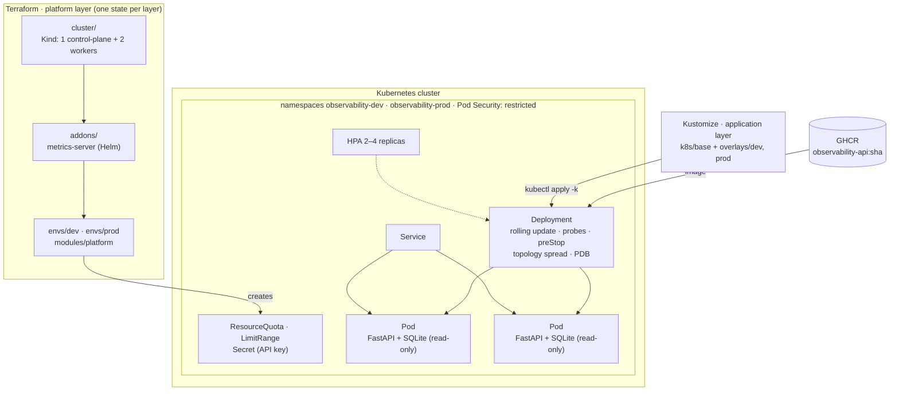

# Infrastructure Observability Platform

**English** · [Español](README.es.md)

[](https://github.com/GabrielPy28/infrastructure-observability-platform/actions/workflows/ci.yml)
[](https://github.com/GabrielPy28/infrastructure-observability-platform/actions/workflows/cd.yml)

A production-style DevOps platform built around an infrastructure monitoring API.
The **product is the platform**, not the API:

- infrastructure as code with Terraform;
- Kubernetes deployments with zero-downtime rollouts;
- a CI/CD pipeline with security gates and end-to-end tests on an ephemeral cluster;
- resilience scenarios with measured results.

Everything runs locally on [Kind](https://kind.sigs.k8s.io/) at zero cost, and a
validated (never applied) Terraform module describes the same platform on AWS EKS.

## Highlights

- **Infrastructure as Code in layers:** Terraform creates the cluster, the
  cluster-wide add-ons and each environment, each with its own state.
- **Clear ownership boundary:** Terraform owns the platform and Kustomize owns the
  application. `terraform plan` shows no drift after deploying.
- **Zero-downtime deployments:**
  - a broken release never receives traffic and is rolled back automatically;
  - pods terminate gracefully;
  - replicas spread across nodes and scale with an HPA.
- **CI/CD that tests what it ships:** the pipeline publishes the image to GHCR,
  then deploys **that exact image** to a fresh cluster created by Terraform and
  verifies that the pods run the commit SHA.
- **Security by default:**
  - Pod Security `restricted`, non-root read-only containers and per-environment
    API keys;
  - actions pinned by SHA, plus Trivy gates for image and IaC.
- **Measured resilience:** 4 scenarios, **14,006 requests, 0 errors**. They also
  uncovered 6 real issues, all fixed and documented.

## Architecture



| Layer | Tool | Owns |
|---|---|---|
| Cluster | Terraform (`tehcyx/kind`) | Kind cluster, kubeconfig |
| Add-ons | Terraform (`helm`) | metrics-server (feeds the HPA) |
| Platform per environment | Terraform (`kubernetes`) | Namespace with Pod Security `restricted`, ResourceQuota, LimitRange, API key Secret |
| Application | Kustomize | Deployment, Service, HPA, PodDisruptionBudget, ConfigMap |

## CI/CD pipeline

```mermaid
flowchart LR
  DEV(["Developer"]) -->|pull request| CI

  subgraph CI["CI · every PR · 5 required checks"]
    direction TB
    CI1["App · ruff + pytest"]
    CI2["Docker · hadolint, build, Trivy"]
    CI3["Terraform · fmt, validate, tflint"]
    CI4["Kubernetes · kubeconform"]
    CI5["Security · Trivy IaC scan"]
  end

  CI -->|merge to main| PUB

  subgraph CD["CD · every merge to main"]
    direction LR
    PUB["Build → Trivy gate<br/>→ push GHCR :sha"] --> UP["Ephemeral cluster<br/>task tf:up"]
    UP --> D1["Deploy dev<br/>→ smoke test"]
    D1 --> D2["Promote prod<br/>→ smoke test"]
    D2 --> DOWN["task tf:down"]
  end
```



- The pipeline has **no deployment logic of its own**: it runs the same Task
  commands a developer runs locally (`task tf:up`, `task k8s:apply`,
  `task k8s:smoke`).
- If a rollout fails, `k8s:apply` runs `kubectl rollout undo` and fails the job.
- The smoke test asserts that `/readyz` reports the deployed commit SHA, which
  gives traceability from **commit → image → running pod**.

## Tech stack

| Area | Tools |
|---|---|
| Application | Python 3.12, FastAPI, SQLite, Faker (build-time only), pytest, ruff |
| Containers | Docker multi-stage build, non-root, read-only root filesystem |
| Kubernetes | Kind (Kubernetes 1.35), Kustomize, HPA, PDB, Pod Security Admission, metrics-server |
| Infrastructure as Code | Terraform (`tehcyx/kind`, `kubernetes`, `helm`, `random`, `aws`), tflint |
| CI/CD | GitHub Actions, GHCR, Dependabot |
| Security | Trivy (image + IaC), hadolint, kubeconform, SHA-pinned actions |
| Testing | pytest (31 tests), smoke tests, k6 load tests, resilience scenarios |
| Tooling | [Task](https://taskfile.dev) — a single command interface for local work and CI |

## Quick start

**Prerequisites:**

- Docker;
- [kind](https://kind.sigs.k8s.io/) ≥ 0.31;
- kubectl;
- Terraform ≥ 1.10;
- [Task](https://taskfile.dev) 3.x;
- Python ≥ 3.10.

```bash
# 1. Platform: Kind cluster, metrics-server, dev and prod environments
task tf:up -- -auto-approve

# 2. Build the image, load it into Kind and deploy
task k8s:deploy ENV=prod

# 3. Verify the deployment (health, version, API key, data)
task k8s:smoke ENV=prod

# 4. Explore the API at http://localhost:8080/docs → "Authorize" with the key
task k8s:api-key ENV=prod
task k8s:port-forward ENV=prod

# 5. Run the resilience scenarios (~8 min)
task scenario:all

# 6. Tear everything down
task tf:down -- -auto-approve
```

To work on the API without Kubernetes, run `task app:test` or `task app:run`
(Swagger at <http://localhost:8000/docs>). Run `task --list` to see every command.

## Resilience scenarios

Availability is measured from **inside the cluster** by a client pod that sends
4 requests per second to the Service. A port-forward would only reach a single pod,
so it would not reflect what a real consumer sees.

| Scenario | Injected fault | Requests | Availability |
|---|---|---:|---:|
| 1. Healthy deployment | — | 63 | 100% |
| 2. Pod & node failure | Pod deletion, node drain, rolling restart | 190 | 100% |
| 3. Bad deployment | Release never becomes Ready → deadline exceeded → rollback | 545 | 100% |
| 4. Autoscaling | k6 load: HPA scales 2 → 4 replicas in 51 s, p95 12 ms | 13,208 | 100% |

The scenarios uncovered six real issues: HTTP 500s under concurrency, a fix that
never rolled out, a request lost during pod termination, replicas concentrated on
a single node, nodes left cordoned and an overloaded local VM. Each one has its root
cause and fix documented in [docs/scenarios.md](docs/scenarios.md) *(in Spanish)*.

## API

A read-only API over a deterministic dataset generated at build time: 10
datacenters, 500 servers, 5,000 incidents and 2,000 deployments. The `/api/v1/*`
endpoints require the `X-API-Key` header.

| Endpoint | Description |
|---|---|
| `GET /healthz` | Liveness: the process is running (no dependencies checked) |
| `GET /readyz` | Readiness: the database answers; reports the deployed version |
| `GET /api/v1/datacenters[/{id}]` | Datacenters with server counts |
| `GET /api/v1/servers` | Filter by `environment`, `region`, `status`, `datacenter_id`, `search`; sort and paginate |
| `GET /api/v1/servers/summary` | Health summary (healthy / warning / critical) with the same filters |
| `GET /api/v1/servers/{id}` | Server detail |
| `GET /api/v1/incidents[/{id}]` | Filter by `severity`, `status`, `type`, `server_id` |
| `GET /api/v1/deployments[/{id}]` | Filter by `service`, `environment`, `status` |

## Repository structure

```text
├── app/                  FastAPI app, SQLite seed (Faker), tests, multi-stage Dockerfile
├── k8s/
│   ├── base/             Deployment, Service, HPA, PDB, ConfigMap generator
│   └── overlays/         dev (HPA 1–2) and prod (HPA 2–4)
├── terraform/
│   ├── cluster/          Layer 1: Kind cluster
│   ├── addons/           Layer 2: metrics-server
│   ├── modules/platform/ Namespace + PSA, quota, limit range, API key secret
│   ├── envs/{dev,prod}/  Layer 3: one state per environment
│   └── aws/eks/          EKS equivalent: validated in CI, never applied
├── scripts/
│   ├── smoke_test.py     Post-deployment checks
│   ├── scenarios/        Resilience scenarios
│   └── load/             k6 load test
├── docs/
│   ├── adr/              Architecture Decision Records
│   └── scenarios.md      Resilience evidence and findings
├── .github/              CI and CD workflows, Dependabot
└── Taskfile.yml          Single command interface (local and CI)
```

## Design decisions

Each key decision is documented as an ADR *(in Spanish)* in [docs/adr](docs/adr/README.md):

1. [Local Kind instead of EKS](docs/adr/0001-kind-local-en-lugar-de-eks.md), with a validated EKS module
2. [Read-only SQLite baked into the image](docs/adr/0002-sqlite-de-solo-lectura-en-la-imagen.md), so pods are stateless
3. [Terraform / Kustomize ownership boundary](docs/adr/0003-frontera-terraform-kustomize.md), with no drift
4. [Terraform state per layer and environment](docs/adr/0004-state-de-terraform-por-capas.md)
5. [Same commands locally and in CI/CD, with E2E on an ephemeral cluster](docs/adr/0005-cicd-mismas-tareas-y-cluster-efimero.md)
6. [Zero-downtime deployment strategy](docs/adr/0006-despliegues-sin-downtime.md)
7. [Supply chain and runtime security](docs/adr/0007-seguridad-de-la-cadena-de-suministro.md)

## From local to AWS

[terraform/aws/eks](terraform/aws/eks) defines the same platform on AWS:

- a VPC with private nodes and flow logs;
- EKS 1.35 with a private API endpoint and managed add-ons;
- GitHub OIDC for keyless deployments, with an IAM role restricted to `main` and
  edit permissions limited to the application namespaces;
- Terraform state in S3 with native locking.

Only the cluster layer changes: the platform module, the Kustomize manifests and
the image are reused as they are. CI validates the module on every pull request
(`fmt`, `validate`, tflint, Trivy) without credentials or cost. The migration guide,
security decisions and cost estimate are in
[terraform/aws/README.md](terraform/aws/README.md) *(in Spanish)*.

## Future work

- **Monitoring and GitOps[^1]:** add Prometheus and Grafana for metrics and
  dashboards, and ArgoCD for pull-based continuous delivery to a persistent cluster.
- **Supply chain:** image signing with cosign and SBOM generation.

[^1]: Intentionally out of scope. The project focuses on infrastructure as code,
    Kubernetes and the CI/CD pipeline; the `/metrics` path is reserved for a future
    Prometheus integration.

## Author

**Gabriel Piñero** — [LinkedIn](https://www.linkedin.com/in/gabriel-piñero-a151321a9/)
